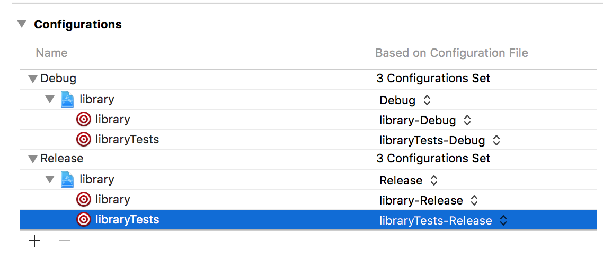

# xcconfig-extractor
Refactor buildSettings into xcconfigs.

[](https://app.bitrise.io/app/31197448d2a1080e)
[](https://www.patreon.com/bePatron?u=13627375)

# Requirements
- Xcode10+ is officially supported, but should work against older ones too.

# Usage

```bash
$ xcconfig-extractor /path/to/Your.xcodeproj Configurations
```

This will create xcconfig files under `Configuration` dir. Configurations are removed from `buildSettings` section of pbxproj.

Generated xcconfigs are added to your project automatically. ✏️



# Available Options
```bash
Options:
    --no-trim-duplicates [default: false] - Don't extract duplicated lines to common xcconfig files, simply map each buildSettings to one file.
    --no-edit-pbxproj [default: false] - Do not modify pbxproj at all.
    --include-existing [default: true] - `#include` already configured xcconfigs.
    --no-set-configurations [default: false] - Do not set xcconfig(baseConfigurationReference) in pbxproj. Ignored if `--no-edit-pbxproj` is true.
```

# Build Setting Validation
⚠️ ***Waring*** ⚠️

`xcconfig-extractor` is a refactoring tool. It shouldn't affect your App's actual "Build Setting".  

Recommended way to check Build Settings is to use `xcodebuild` command. Make sure outputs does not change between before and after.

```bash
$ xcodebuild -showBuildSettings -configuration Release > before
$ # apply xcconfig-extractor
$ xcodebuild -showBuildSettings -configuration Release > after
$ diff before after # should prints nothing!
```

If outputs differ, fix it manually e.g. simply by adding missing value to target's xcconfig.

xcconfig does not allow any `$(inherited)` from `#include`ing xcconfigs. (See: https://github.com/toshi0383/xcconfig-extractor/pull/8#issuecomment-298234943) So if you have any existing xcconfig configured on your project, it might cause problems.
[This article](https://pewpewthespells.com/blog/xcconfig_guide.html#BuildSettingInheritance) is helpful to understand how inheritance works.

# agvtool compatibility
⚠️ ***Waring*** ⚠️

If you use `agvtool` for automatic versioning, it won't work after applying `xcconfig-extractor`.  
`agvtool` updates versions correctly iff `INFOPLIST_FILE` is configured in Xcode's buildSettings section.

So make sure you either
- Restore `INFOPLIST_FILE` in Xcode's buildSettings section.

or
- Quit using `agvtool` and fallback to other tools like `/usr/libexec/PlistBuddy` to update Info.plist.

e.g.
```bash
/usr/libexec/PlistBuddy -c "Set :CFBundleShortVersionString $(git describe --tags --abbrev=0)" App/Info.plist
/usr/libexec/PlistBuddy -c "Set :CFBundleVersion ${BITRISE_BUILD_NUMBER}-${BITRISE_GIT_BRANCH}" App/Info.plist
```

# Install
## Binary install
I've written install/release scripts for SwiftPM executable.  
This should be the easiest way.
```
bash <(curl -sL https://raw.githubusercontent.com/toshi0383/scripts/master/swiftpm/install.sh) toshi0383/xcconfig-extractor
```

Or go to the [release page](https://github.com/toshi0383/xcconfig-extractor/releases) and download `xcconfig-extractor.zip` go download the standalone binary manually.

## Build from source
- Clone this repo and run `swift build -c release`.  
- Executable will be created at `.build/release/xcconfig-extractor`.

# Donate
If you think it's a useful tool, consider donation to maintain project.

[](https://www.patreon.com/bePatron?u=13627375)

# License
MIT
